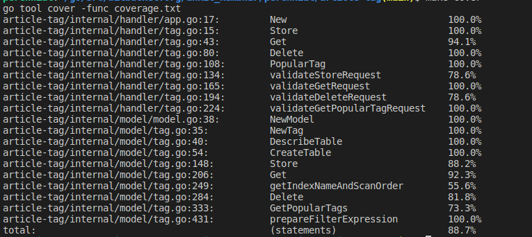

# article-tag


- **article-tag** is a demo repo representing the use of dynamodb with golang. 
- With this example you will get the deep understanding of dynamodb, factors to keep while designing dynamodb.

## Setup process

### Running Application
To build and run container:

```shell
make run
```

To stop running containers:
```shell
make stop
```

### Testing
Used `testing` package that is built-in in Golang. To run unit tests run following command

```shell
make unit-test
```

To check the coverage run
```shell
make cover
```

### Coverage:
